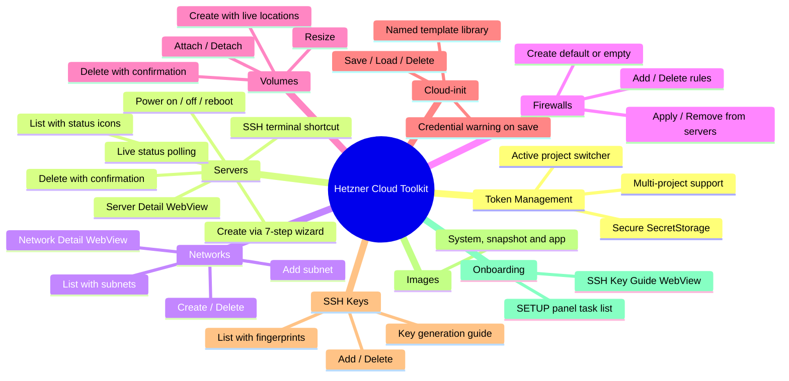
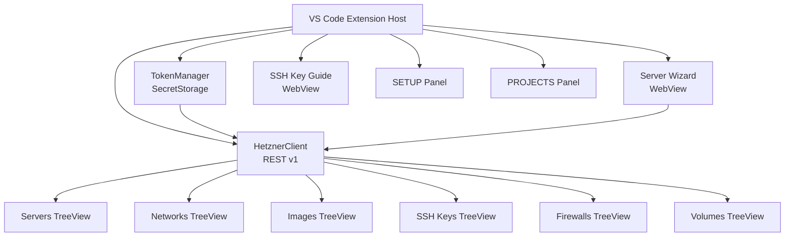
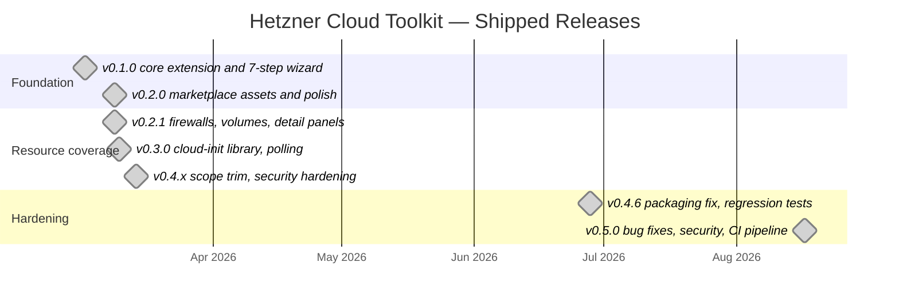

# Roadmap — Hetzner Cloud Toolkit

> A VS Code extension for managing [Hetzner Cloud](https://www.hetzner.com/cloud) infrastructure directly from the editor.
> This is an unofficial community extension, unaffiliated with Hetzner Online GmbH.

---

## Status Snapshot — 2026-08-17

`v0.5.0` is live on the Marketplace. It was primarily a correctness and hardening release.

**Dead commands fixed.** `hcloud.addSubnet` and `hcloud.refreshImages` were declared in `package.json` but never registered, so the Images refresh button and both Add Subnet entry points (tree context menu and network detail panel) threw *"command not found"*. Both now work.

**Data-loss bug fixed.** Firewall rule deletion matched rules by content, so deleting one rule removed *every* rule with the same direction/protocol/port/IPs — rules differing only by description were destroyed together. Deletion is now index-based and removes exactly one rule.

**IPv6-only servers can now SSH.** Hetzner reports IPv6 as a `/64` prefix, which failed IP validation outright. The conventional `::1` host address is now derived for SSH and display.

**Security hardening.** Cloud-init templates warn when content looks like credentials (template storage is unencrypted); `hcloud.defaultRegion` is base64-transported into the WebView, closing a markup-injection path from a malicious workspace `.vscode/settings.json`; CSP meta tags and nonce handling tightened across WebViews; firewall CIDR input strictly validates; IP validation rebuilt on Node's `net.isIP`.

**Toolchain and CI modernised.** TypeScript 5.9, ESLint 10 flat config, typescript-eslint 8, esbuild 0.28.2. Minimum VS Code raised to 1.100. CI now runs on Node 24 with a `ci.yml` gate on every push and PR, and an automated tag-triggered release pipeline (`release.yml`) that builds and tests with no secret access, then publishes behind a `marketplace-publish` environment approval gate.

Full detail in the [`[0.5.0]` CHANGELOG entry](CHANGELOG.md).

---

## Current State — v0.5.0

Live on the Marketplace. Eight tree views in the sidebar — Setup, Projects, Servers, Networks, Images, SSH Keys, Firewalls and Volumes — backed by the Hetzner Cloud REST API v1.

---

## Architecture

---

## Release Plan

Shipped releases, by actual release date:

### Remaining for v1.0.0

| Feature | Status |
|---------|--------|
| **Load balancers** | The one substantial resource type with no UI. The API client layer already exists — `listLoadBalancers`, `getLoadBalancer`, `createLoadBalancer`, `deleteLoadBalancer`, `addTarget`, `removeTarget` and `load_balancer_types` are all implemented in `src/api/hetzner.ts`. A Load Balancers panel shipped in v0.2.1 and was removed in v0.4.0 when scope was trimmed, so re-adding it is a providers/commands/menus job rather than an API one. |

Everything else from the original v1.0.0 list has shipped: firewall CRUD and volumes landed in v0.2.1, and Marketplace publication has been live since the early releases.

---

## Backlog

### Recently completed

| Feature | Notes |
|---------|-------|
| **IPv6 validation edge case in `isValidIpAddress()`** | ✅ Fixed in v0.5.0. The old regex accepted malformed/incomplete IPv6 forms such as `1:2:3` without `::` compression. `src/utils/network.ts` was rewritten on Node's `net.isIP`, and the fix is covered by the regression suite. This was always defense-in-depth rather than a security hole — the validator's character set blocked shell metacharacters, so no injection path existed. |

### v0.2.0 — Polish *(delivered)*

| # | Feature | Notes |
|---|---------|-------|
| 1 | **Auto-refresh trees after power actions** | After start/stop/reboot, `serversProvider.refresh()` auto-fires |
| 2 | **Server detail WebView** | Click a server → panel with IPs, specs, datacenter, Hetzner console link |
| 3 | **Network subnets** | Expand network node to show subnets; add/remove subnet commands |
| 4 | **SSH key auto-select after add in wizard** | Newly added key pre-selected when wizard step reloads |

### v0.3.0 — Productivity *(delivered)*

| # | Feature | Notes |
|---|---------|-------|
| 5 | **Cloud-init template library** | Save/load named templates |
| 6 | **Server status polling** | Poll while `initializing`, update tree icon live |

### v1.0.0 — Full Coverage

| # | Feature | Notes |
|---|---------|-------|
| 8 | **Firewall rules CRUD** | ✅ Delivered in v0.2.1 |
| 9 | **Volumes** | ✅ Delivered in v0.2.1 |
| 10 | **Load balancers** | Still open — see *Remaining for v1.0.0* above |
| 11 | **Marketplace publish** | ✅ Delivered; now automated via `release.yml` behind an approval gate |

### Future Ideas

| # | Feature | Notes |
|---|---------|-------|
| 12 | **Tailscale integration** | Parked — store auth key, auto-inject into cloud-init on server creation |
| 13 | **Custom Cloud Console WebView** | Embedded Hetzner Cloud Console inside VS Code with custom design/skin/layout. |
| 13 | **Multiple API tokens per project** | Support adding multiple tokens for same project (token rotation, different access levels). Current: 1 token = 1 project. Note: Hetzner Cloud API tokens are per-project only (no global account token exists). |
| 14 | **Token metadata & labels** | Label tokens by purpose (e.g. "Production Read-Only", "Staging Full Access") for better organization |
| 15 | **API token health check** | Periodic validation to detect expired/revoked tokens; show warning icon in Projects tree |
| 16 | **Open VSX Registry publishing** | Considered and deliberately deferred. Publishing to [Open VSX](https://open-vsx.org) alongside the Microsoft Marketplace would reach VSCodium, Gitpod and Cursor users, who cannot install from the Microsoft Marketplace at all. Implementation is small — an `ovsx publish` step in `release.yml`'s existing publish job, inheriting the same `marketplace-publish` approval gate. The cost is a second credential: an `OVSX_PAT` to create, store and rotate. Not worth taking on right now, given how much PAT and publishing-identity friction this project already absorbed during the v0.5.0 cycle. Revisit when the existing Marketplace PAT comes up for rotation. |

---

## Contributing

Contributions, bug reports, and feature requests are welcome.
Open an [issue](https://github.com/brwinnov/HetznerCloudToolkit/issues) or submit a PR.

This extension uses **no external runtime dependencies** — just native `fetch` and the VS Code API.
